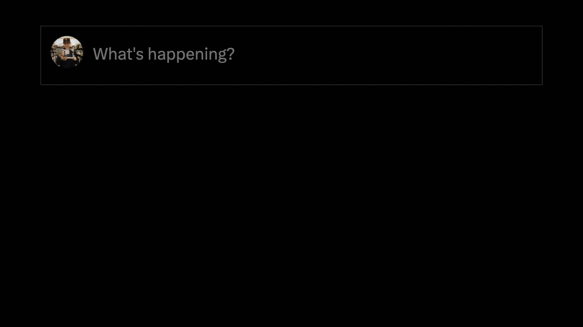

# x-improvements

my ideas for redesigning x.com, one component at a time

 

## 🧩 Components

A growing set of redesigned X components. More to come.

| Component | What it is | Try it |
|-----------|------------|--------|
| **Web Composer** | A redesigned X compose box | [Live demo](https://stevederico.github.io/x-improvements/web-composer/composer-r1/index.html) |

 

## ✍️ Web Composer

A self-contained HTML/JS prototype of a redesigned X compose box.

**[▶ Try the live demo](https://stevederico.github.io/x-improvements/web-composer/composer-r1/index.html)**

  

**Improvements**

- **fullscreen mode** — floating close button in upper right, Cmd+. to toggle, persistent toolbar, Escape to exit
- **icons on focus** — toolbar stays hidden until you focus the editor
- **generate image** — custom Grok image-generation icon added to the toolbar
- **no dropdowns in writing area** — audience and "who can reply" (6 options) folded into a single toolbar popup with live label sync
- **no counter for premium** — character count inlined and shown based on Free/Premium (hard 280 limit in Free mode)
- **no bold for usernames + links** — bold/italic only applies to formattable text, not usernames or links

Lives in `web-composer/` — a frozen `baseline` plus the working `composer-r1` revision.

 

## 🛠 Tech Stack

| Technology | Purpose |
|------------|---------|
| Vanilla JS + DOM | all interactivity and state |
| Tailwind via CDN + inline config | styling and custom X palette |
| External fonts from twimg | Chirp font family |

 

## 📄 License

MIT License

 

Concept redesigns of X.com components.

