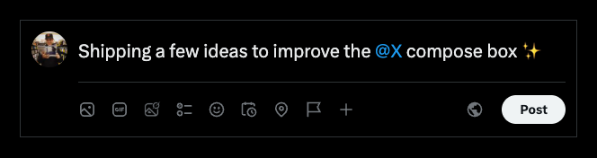

# x-improvements

my ideas for improving the x.com compose box — a self-contained html/js prototype

 

  

 

## 🚀 Quick Start

Open `index.html` in a browser and pick a composer revision. No build or install.

 

## ✨ Features

- **Audience pill** and reply scope that appear on editor focus
- **Who can reply popover** with 6 options and live label sync
- **X toolbar** icons for photo, gif, generate image, poll, emoji, schedule, location, disclosure
- **Auto-growing editor** with a premium-aware counter (hard 280 limit in Free mode)
- **Post / add / reset** controls with disabled states

 

## ⚡ Improvements

- **Premium-aware counter** — character counter inlined and shown based on Free/Premium status
- **Focus-gated toolbar** — toolbar stays hidden until there's text
- **Custom generate-image icon** — bespoke Grok/generate-image glyph in the toolbar
- **Integrated audience menu** — audience and reply settings folded into the toolbar
- **Smart formatting** — bold/italic only applies to formattable text

 

## 🛠 Tech Stack

| Technology | Purpose |
|------------|---------|
| Vanilla JS + DOM | all interactivity and state |
| Tailwind via CDN + inline config | styling and custom x palette |
| External fonts from twimg | Chirp font family |

 

## 📄 License

MIT License

 

Single-file replica of the X compose box.

